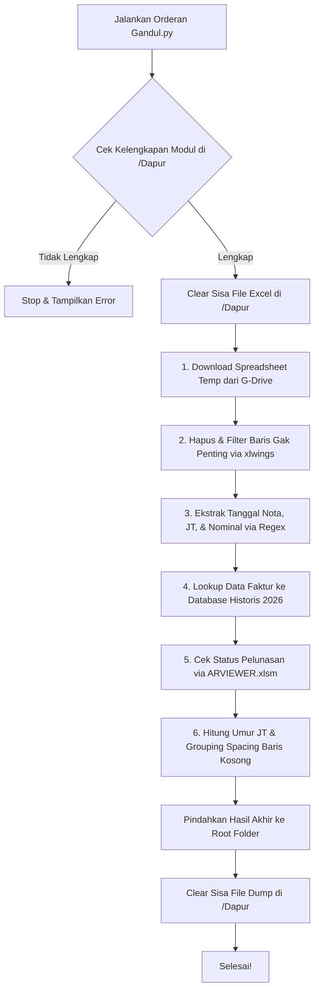

# Analisa-Orderan-Pending
```python
🏍️ Automasi Pengolahan Data Order IRC & ZN (Jateng)

Repositori ini berisi sistem automasi berbasis Python untuk mengunduh, membersihkan, mengekstrak, mencocokkan (lookup), mendeteksi status pelunasan, hingga melakukan finalisasi data piutang/orderan merek **IRC** dan **ZN** untuk wilayah Jawa Tengah.

Seluruh workflow diatur secara sekuensial oleh program utama: `Jalankan Orderan Gandul.py`.

---

## 📂 Struktur Direktori

Sistem ini menggunakan arsitektur modular di mana modul-modul pekerja diletakkan di dalam folder operasional bernama `Dapur/`.

```

```text
📂 project-root/
│
├── 📄 Jalankan Orderan Gandul.py         # 🚀 Program Utama (Orchestrator)
│
└── 📂 Dapur/                             # 🏗️ Ruang Pemrosesan Data (Modul)
    ├── 📄 __init__.py                    # Inisialisasi package python
    ├── 📄 1_Unduh IRC ZN File.py         # Unduh source file dari Google Sheets
    ├── 📄 2_Hapus dan Filter Data.py     # Clean-up baris & pre-filtering awal
    ├── 📄 3_Ekstrak Komen IRC.py         # Regex extraction untuk komentar/cell IRC
    ├── 📄 3_Ekstrak Komen ZN.py          # Regex extraction untuk komentar/cell ZN
    ├── 📄 4_LookupDatas IRC.py           # VLOOKUP/Pencocokan data piutang historis IRC
    ├── 📄 4_LookupDatas ZN.py            # VLOOKUP/Pencocokan data piutang historis ZN
    ├── 📄 5_Cek Pelunasan IRC.py         # Validasi sisa piutang vs ARVIEWER IRC
    ├── 📄 5_Cek Pelunasan ZN.py          # Validasi sisa piutang vs ARVIEWER ZN
    ├── 📄 6_FinalisasiData IRC.py        # Formatting akhir, gap day (JT) & group spacing IRC
    └── 📄 6_FinalisasiData ZN.py         # Formatting akhir, gap day (JT) & group spacing ZN

```

---

## ⚙️ Workflow Alur Kerja Otomatisasi

Program utama (`Jalankan Orderan Gandul.py`) mengeksekusi pipeline data dengan urutan langkah sebagai berikut:



### Detail Fungsi Tiap Script:

1. **`1_Unduh IRC ZN File.py`**: Mengambil data live ter-update dari Google Spreadsheet via request ekspor `.xlsx` dan menyimpannya sebagai berkas `_temp.xlsx`.
2. **`2_Hapus dan Filter Data.py`**: Menggunakan `xlwings` untuk menghapus row master/template bawaan, menyembunyikan kolom yang tidak esensial, mengatur lebar kolom, serta memfilter data kosong secara programatis.
3. **`3_Ekstrak Komen [Merek].py`**: Membaca cell value dan objek text comment di excel menggunakan `openpyxl`. Menggunakan pencocokan pola Regular Expression (`Regex`) untuk memilah secara akurat: *Tanggal Nota*, *Tanggal Jatuh Tempo*, dan *Nominal Rincian*.
4. **`4_LookupDatas [Merek].py`**: Menelusuri sub-folder bulanan di path database (`E:\\ADM IRC AND ZN\\2026`) untuk melakukan verifikasi silang kecocokan nomor faktur dan tanggal jatuh tempo, kemudian menandainya sebagai `BENAR` atau `SALAH`.
5. **`5_Cek Pelunasan [Merek].py`**: Membaca lembar kerja `Source` pada aplikasi `ARVIEWER.xlsm` secara instan, menghitung nilai terbayar (`Nilai Faktur - Sisa Piutang`), lalu memberikan status konkrit: `Lunas`, `Belum Bayar`, atau `Bayar Setengah`.
6. **`6_FinalisasiData [Merek].py`**: Menyusun susunan layout akhir data, menyisipkan baris kosong (`blank row`) otomatis sebagai pemisah visual antar entitas toko/sales, serta menghitung selisih hari (`Umur Jatuh Tempo`) relatif terhadap tanggal hari ini.

---

## 🚀 Prasyarat & Instalasi

Sebelum menjalankan program, pastikan perangkat Anda telah terpasang **Python 3.8+** dan beberapa dependensi library eksternal.

### 1. Install Library Dependensi

Buka terminal / Command Prompt, lalu jalankan perintah berikut:

```bash
pip install requests openpyxl pandas xlwings

```

### 2. Kebutuhan Environment & Path File

Beberapa script bergantung pada software lokal Microsoft Excel (untuk engine `xlwings`) dan path direktori harddisk spesifik. Pastikan file berikut tersedia di komputer Anda:

* File referensi pelunasan: `E:\\ADM IRC AND ZN\\ARVIEWER.xlsm`
* Folder arsip data tahunan: `E:\\ADM IRC AND ZN\\2026\\`

---

## 💻 Cara Penggunaan

Anda cukup berinteraksi dengan satu file utama di luar folder Dapur.

1. Buka Terminal / CMD di direktori project utama.
2. Jalankan perintah:
```bash
python "Jalankan Orderan Gandul.py"

```


3. Program akan menampilkan log proses baris demi baris:
```text
--> Menjalankan 1_Unduh IRC ZN File.py...
--> Menjalankan 2_Hapus dan Filter Data.py...
...
--> File Hasil_Ekstrak_Rincian_ZN.xlsx berhasil dipindahkan.
--> File Hasil_Ekstrak_Rincian_IRC.xlsx berhasil dipindahkan.
--> Semua proses selesai dan folder Dapur telah dibersihkan.

```


4. Periksa **Root Folder (direktori utama)** Anda. Dua file laporan siap pakai hasil kalkulasi akhir akan muncul di sana:
* 📊 `Hasil_Ekstrak_Rincian_IRC.xlsx`
* 📊 `Hasil_Ekstrak_Rincian_ZN.xlsx`


---

## 🛠️ Fitur Keamanan Kode (Error Handling)

* **Modul Validation Guard**: Program utama akan memvalidasi keberadaan seluruh file di dalam folder `Dapur/` sebelum memulai pemrosesan. Jika ada 1 file saja yang hilang, proses akan langsung dibatalkan secara aman (`sys.exit()`) tanpa merusak data.
* **Automated Clean-up**: Setiap sebelum dan sesudah runtime, program secara otomatis menghapus file dump/temporary `.xls` atau `.xlsx` di dalam folder `Dapur/` agar workspace tetap bersih dan hemat penyimpanan.
* **Transaction Rollback State**: Jika salah satu script di tengah urutan mengalami *crash* atau kegagalan data, eksekusi pipeline dihentikan seketika sehingga tidak membuang resource proses selanjutnya yang salah.

---

💡 *Catatan: Pastikan koneksi internet aktif saat menjalankan program untuk proses download file spreadsheet di awal step.*
